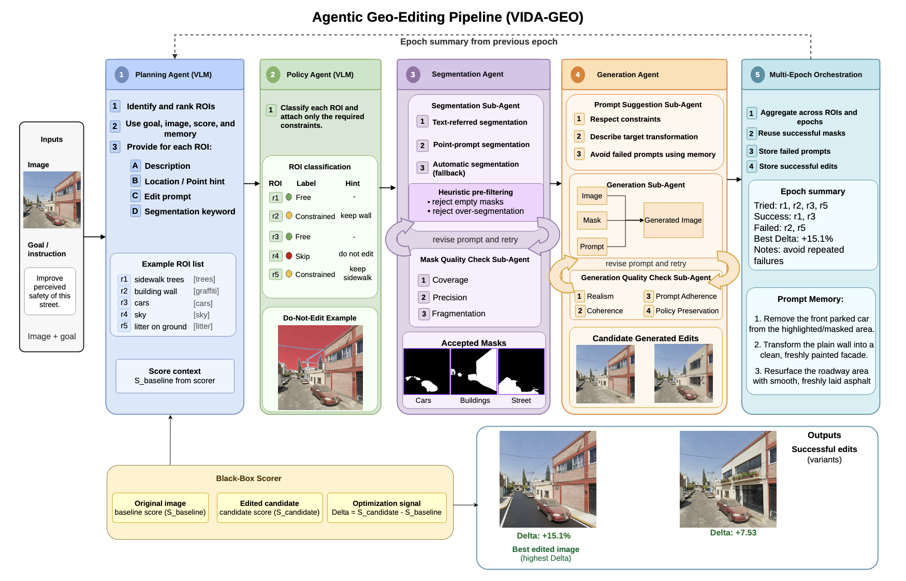

# VIDA-GEO: A Multi-Agent Pipeline for Indicator-Guided Geospatial Image Editing 🛰️🏙️

VIDA-GEO is a unified multi-agent system that edits satellite and street-level
imagery to move a target **black-box indicator score** (e.g. perceived safety,
greenery, road risk) in a chosen direction. A reasoning agent plans regions, a
policy agent constrains them to physically plausible edits, a segmentation agent
produces masks via a tool chain, and two image editors compete to produce the
edit with the best score change — all validated by quality-control agents.

---

## Contents
- [Overview](#overview)
- [Domains](#domains)
- [Architecture](#architecture)
- [Prompt Reference](#prompt-reference)
- [Environment Setup](#environment-setup)
- [Model Servers](#model-servers)
- [Running](#running)
- [Outputs](#outputs)
- [Acknowledgements](#acknowledgements)

---

## Overview

Given an input image and a target domain, VIDA-GEO:

1. **Scores** the image with the domain's black-box indicator model (baseline).
2. **Plans** candidate regions to edit (reasoning VLM).
3. **Checks policy** — classifies each region as free / constrained / remove-only /
   skip, and outputs constraints the generation agent must respect.
4. **Segments** each region through a tool chain (text-referred segmentation →
   point-prompt fallback → bounding-box clip → best-effort), gated by a
   mask quality-control agent.
5. **Generates** edits with two editors competing in parallel (a masked inpainter
   and a full-image generator), each guided by editor-specific prompts.
6. **Validates & scores** every candidate: an edit-QC agent checks adherence and
   constraint compliance, the indicator model re-scores, and the best score
   change (delta) wins.

Optional **multi-epoch** and **two-phase** orchestration iteratively refine or
re-edit successful regions.

## Domains

VIDA-GEO covers two modalities and eight domains, defined declaratively in
`configs/domains.yaml`:

| Modality   | Domain        | Indicator (scorer) | Direction (improve) |
|------------|---------------|--------------------|---------------------|
| Satellite  | `road_safety` | road risk          | minimize risk       |
| Satellite  | `greenery`    | greenery coverage  | maximize greenery   |
| GSV        | `safety`      | perceived safety   | maximize            |
| GSV        | `lively`      | perceived liveliness | maximize          |
| GSV        | `beautiful`   | perceived beauty   | maximize            |
| GSV        | `wealthy`     | perceived wealth   | maximize            |
| GSV        | `boring`      | perceived boringness | minimize          |
| GSV        | `depressing`  | perceived depressingness | minimize      |

`--goal worsen` flips the direction for any domain. The registry is the single
source of truth for each domain's scorer, score key, direction, prompt group,
and "already-optimal" threshold.

## Architecture


<p align='center'>

</p>

Two model roles, set independently:
- **Reasoning model** (planning, policy, suggestion, QC) — OpenRouter, env
  `OPENROUTER_MODEL`.
- **Editor model** (Gemini image edit/removal) — OpenRouter, env `GEMINI_EDIT_MODEL`.

## Prompt Reference

The complete prompt catalog—including initial and later-epoch planning, policy
review, text-segmentation requests, generation suggestions, Gemini image-edit
instructions, mask QC, edit QC, and their modality-specific variants—is available
on the [**Pipeline Prompt Reference**](docs/PROMPTS.md) page.

The page is generated directly from the committed prompt templates so its stable
system prompts remain synchronized with `configs/prompts/`:

```shell
python scripts/build_prompt_reference.py
```

For a full Qwen3-VL visual-quality and scene-realism evaluation, use the
self-contained evaluator in [`llm_judge/qwen3vl_evaluate.py`](llm_judge/qwen3vl_evaluate.py).
Its default provider, backend, and model are OpenRouter, Chat Completions, and
`qwen/qwen3-vl-32b-instruct`:

```shell
export OPENROUTER_API_KEY="sk-or-..."
python llm_judge/qwen3vl_evaluate.py \
  --inputs benchmark_pairs.xlsx \
  --out llm_judge_results_qwen3vl.csv
```

## Environment Setup

The agent environment is intentionally minimal — it talks to model servers over
HTTP and needs **no** deep-learning libraries.

```shell
git clone https://github.com/HosamGen/VIDA-GEO.git
cd VIDA-GEO
conda create -n vida-geo python=3.10 -y
conda activate vida-geo
pip install -r requirements.txt
export OPENROUTER_API_KEY="sk-or-..."           # Openrouter API key required
export OPENROUTER_MODEL="openai/gpt-5.1"      # reasoning model (default)
export GEMINI_EDIT_MODEL="google/gemini-2.5-flash-image"   # editor model (default)
```

[OPTIONAL] Verify the install before running anything (no servers needed):

```shell
python check_structure.py    # registry + all prompt templates resolve
python check_imports.py      # all modules import; config/scorer/CLI wiring OK
```

## Model Servers

Each model runs as an independent FastAPI server in **its own conda environment**
(their dependencies conflict and cannot share one env), optionally on its own GPU.

The agent only needs the servers a given run uses. See [**`servers/README.md`**](https://github.com/HosamGen/VIDA-GEO/blob/main/servers/) for
per-server launch commands, ports, and checkpoints. Ports must match
`configs/services.yaml`.

| Component            | Role                              | Default port | Upstream |
|----------------------|-----------------------------------|--------------|----------|
| Perception scorer    | Place Pulse perception (GSV)      | 8111         | [human-perception-place-pulse](https://github.com/strawmelon11/human-perception-place-pulse) |
| Risk scorer          | road-risk (satellite)             | 8003         | [BetaRisk](https://github.com/FOURM-LAB/BetaRisk) |
| Greenery scorer      | greenery coverage (satellite)     | 8006         | [oem-lightweight](https://github.com/cliffbb/oem-lightweight) |
| LISAt                | text-referred seg (satellite)     | 8001         | [LISAt_code](https://github.com/lisat-bair/LISAt_code) |
| SAM3                 | text-referred seg (all)           | 8005         | [sam3](https://github.com/facebookresearch/sam3) |
| SAM                  | point-prompt fallback (all)       | 8004         | [segment-anything](https://github.com/facebookresearch/segment-anything) |
| FLUX Fill            | masked inpainting editor (all)    | 8002         | [FLUX.1-Fill-dev](https://github.com/black-forest-labs/flux) |

Which servers each domain needs:
- **GSV domains:** perception (8111), SAM3 (8005), SAM (8004), FLUX (8002, unless `--disable_flux`).
- **Satellite domains:** risk **or** greenery (8003 / 8006), LISAt (8001), SAM (8004), SAM3 (8005), FLUX (8002, unless `--disable_flux`).

## Running

```shell
# GSV, Gemini-only (no FLUX server needed)
python -m vida_geo.cli --image path/to/streetview.jpg --domain lively --disable_flux

# GSV, both editors competing (FLUX server running)
python -m vida_geo.cli --image path/to/streetview.jpg --domain safety

# Satellite
python -m vida_geo.cli --image path/to/tile.png --domain road_safety
python -m vida_geo.cli --image path/to/tile.png --domain greenery

# Multi-epoch and two-phase refinement (for sequential editing)
python -m vida_geo.cli --image path/to/img.jpg --domain lively --max_epochs 2 --two_phase

# Reverse the objective (to generate counterfactuals)
python -m vida_geo.cli --image path/to/img.jpg --domain boring --goal worsen
```

| Flag                  | Description                                            | Default |
|-----------------------|--------------------------------------------------------|---------|
| `--image`             | Input image path                                       | (required) |
| `--domain`            | Target domain (see table above)                        | (required) |
| `--goal`              | `improve` or `worsen`                                  | `improve` |
| `--max_epochs`        | >1 enables the multi-epoch loop                        | `1` |
| `--disable_flux`      | Drop FLUX from the editor set                          | off |
| `--disable_gemini`    | Drop Gemini from the editor set                        | off |
| `--output_root`       | Override output directory                              | `outputs/<domain>_runs` |

## Outputs

Each run writes to `outputs/<domain>_runs/<image>_<timestamp>/`:

```
result.json        best candidate, all candidates, deltas, per-stage timings
run.log            human-readable stage-by-stage log (per-segmenter, per-editor)
events.jsonl       structured event stream
baseline.json      baseline indicator score
plan.json          planner regions
policy.json        per-region policy decisions
masks/<region>/    candidate masks (named by segmenter: lisat_*, sam3_*, sam_point_*, bbox_clip)
edits/<region>/    candidate edited images (per editor)
qc/<region>/       mask-QC and edit-QC results (cleaned JSON)
prompts/           suggestion prompts per region/editor
```

## Acknowledgements

VIDA-GEO builds on these open-source models and tools, each run as a server:

+ [human-perception-place-pulse](https://github.com/strawmelon11/human-perception-place-pulse) — perception scoring for street-level imagery.
+ [BetaRisk](https://github.com/FOURM-LAB/BetaRisk) — probabilistic road-risk scoring for satellite imagery.
+ [oem-lightweight](https://github.com/cliffbb/oem-lightweight) — lightweight OpenEarthMap segmentation, used for greenery scoring.
+ [LISAt_code](https://github.com/lisat-bair/LISAt_code) — language-instructed segmentation for satellite imagery.
+ [SAM3](https://github.com/facebookresearch/sam3) and [Segment Anything](https://github.com/facebookresearch/segment-anything) — text-referred and point-prompt segmentation.
+ [FLUX.1 Fill](https://github.com/black-forest-labs/flux) — masked image inpainting editor.
